## Инвалидация кэша

Примечание: В конце файла есть UML диаграмма и код заголовочных файлов.

### Блок схема

#### 1. Где хранится кэш?
Кэшированное вычисленное значение ячейки (или `FormulaError`) хранится в `std::optional<Value> value_` класса `FormulaImpl`.

#### 2. Когда обновляется?
При вызове `FormulaImpl::GetValue(...)` проверяется `value_.has_value()`, если есть - значение возвращается, если нет - выполняется расчет. Результат сохраняется в `value_` и возвращается.

#### 3. Как хранятся зависимости?
В классе `Cell`, в `std::unordered_set<Cell*> incoming_refs_;` для каждой ячейки хранится список ячеек, которые зависят от неё.

#### 4. Как происходит инвалидация кэша?
При вызове `Sheet::SetCell(...)` для всех ячеек, зависимых от задаваемой, вызывается метод `InvalidateCacheRecursive()`.Рекурсивно инвалидируется кэш зависимых от зависимых ячеек и т.д.. Для избежания лишних вычислительных затрат кэш инвалидируется для каждой ячейки только один раз.

#### 5. Как поддерживается актуальным список завивимостей?
При вызове `Sheet::SetCell(...)` или `Sheet::ClearCell(...)`:
1. Если есть ячейка существует, для неё вызывается `GetReferencedCells()` и для всех полученых ячеек из `dependant_cells_` удаляется "старая" ячейка.
2. Если в `dependant_cells_` для какой-то ячейки не осталось зависимых от неё ячеек, эта запись удаляется.
3. Для вызова `Sheet::SetCell(...)` дополнительно вызывается `GetReferencedCells()` для новой ячейки и для всех полученных ячеек новая ячейка добавляется как зависимая.

### UML диаграмма

