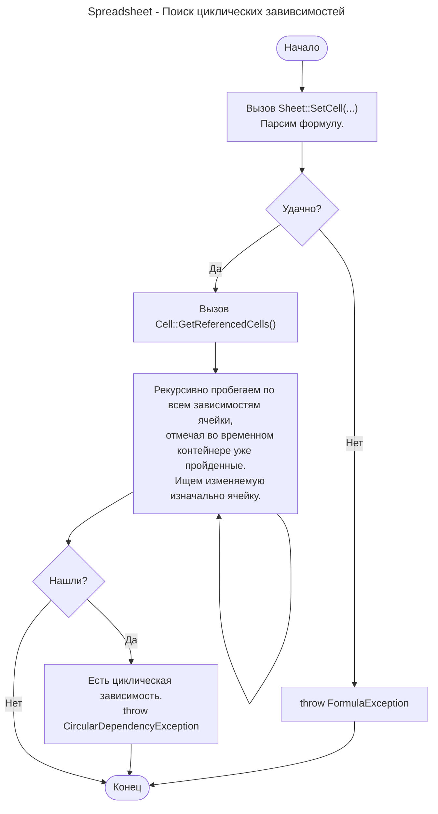

```mermaid
---
title: Spreadsheet - Поиск циклических завивсимостей
---
flowchart TD
    id0(["Начало"])
    id1["Вызов Sheet::SetCell(...)
    Парсим формулу."]
    id2{"Удачно?"}
    id3["throw FormulaException"]
    id4["Вызов Cell::GetReferencedCells()"]
    id5["Рекурсивно пробегаем по всем зависимостям ячейки,
    отмечая во временном контейнере уже пройденные.
    Ищем изменяемую изначально ячейку."]
    id6{"Нашли?"}
    id7["Есть циклическая зависимость.
    throw CircularDependencyException"]
    id9(["Конец"])
    id0 --> id1
    id1 --> id2
    id2 -->|Нет| id3
    id3 --> id9
    id2 -->|Да| id4
    id4 --> id5
    id5 --> id5
    id5 --> id6
    id6 -->|Да| id7
    id7 --> id9
    id6 -->|Нет| id9
```