## Поиск циклических завивсимостей

Примечание: В конце файла есть UML диаграмма и код заголовочных файлов.

### Блок схема

#### 1. Как хранятся зависимости?
В классе `FormulaImpl`, в `std::unordered_set<Cell*> referenced_cells_` для каждой ячейки хранится список ячеек, от которых она зависит.

#### 2. Когда зависимости сохраняются?
При вызове `Cell::Set(...)`, в случае удачного разбора формулы, вызывается `GetReferencedCells()`, происходит проверка на наличие циклических зависимостей, и если их нет реузльтат сохраняется в `refernced_cells_`.

#### 3. Как происходит проверка на циклические зависимости?
При вызове `Cell::Set(...)`, если в ячейки формула, рекурсивно пробегаем по всем зависимостям ячейки. Если встречаем добавляемую ячейку - циклическая зависимость обнаружена, бросаем исключение. Каждая зависимая ячейка должна быть проверена только один раз, для этого отслеживаем все найденные ячейки во временный `std::unordered_set<Cell*>`.

### UML диаграмма

