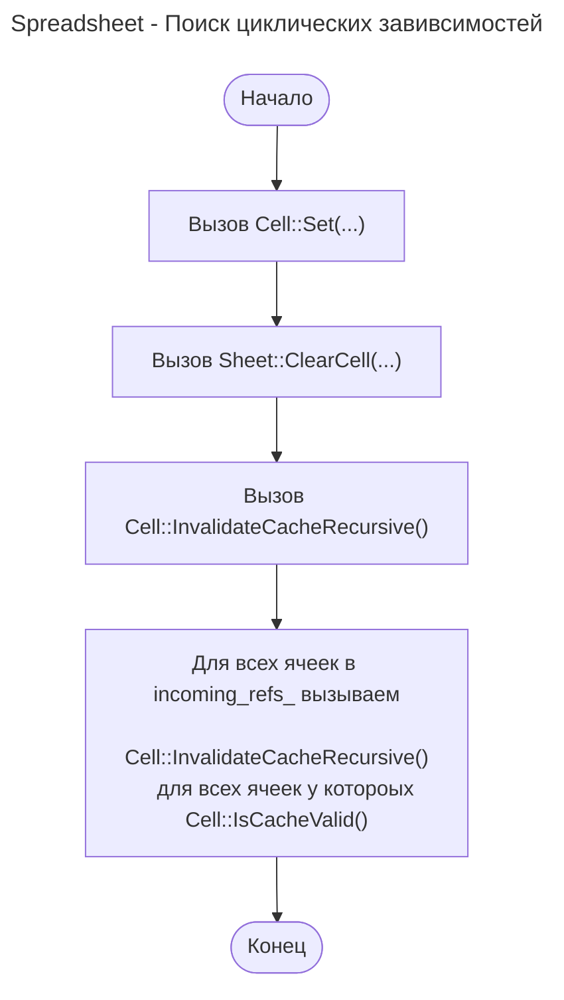

```mermaid
---
title: Spreadsheet - Поиск циклических завивсимостей
---
flowchart TD
    id0(["Начало"])
    id1["Вызов Cell::Set(...)"]
    id2["Вызов Sheet::ClearCell(...)"]
    id3["Вызов Cell::InvalidateCacheRecursive()"]
    id4["Для всех ячеек в incoming_refs_ вызываем
    Cell::InvalidateCacheRecursive()
    для всех ячеек у котороых Cell::IsCacheValid()"]
    id5(["Конец"])
    id0 --> id1
    id1 --> id2
    id2 --> id3
    id3 --> id4
    id4 --> id5
```