## Вычисление значения ячейки

Примечание: В конце файла есть UML диаграмма и код заголовочных файлов.

### Блок схема


#### 1. Когда происходит вычисление?
Вычисление происходит при вызове метода `FormulaInterface::Evaluate(const SheetInterface&)`. Который в свою очередь вызывает метод `FormulaAST::Execute(std::function<double(std::string>)` приватного члена класса `FormulaAST ast_`.

#### 2. Как обеспечивается вычисление значения для `CellExpr`?
В методе `Execute(...)` вызывается виртуальный метод `Evaluate(...)` для корневого `Expr`, в который будет передаваться функция, к примеру так:
```cpp
double FormulaAST::Execute(const SheetInterface& sheet) const {
    return root_expr_->Evaluate([&sheet](const std::string& cell_name) {
        Value val = sheet.GetCell(Position::FromString(cell_name)).GetValue();
        // ... проверяем есть ли значение, и либо возвращаем его, либо выбрасываем исключение
        });
}
```
Возможно будет передаваться функциональный объект. В процессе определюсь. Благодаря такой передаваемой функции `CellExpr` сможет вычислять значения в ячейке.

### UML диаграмма
