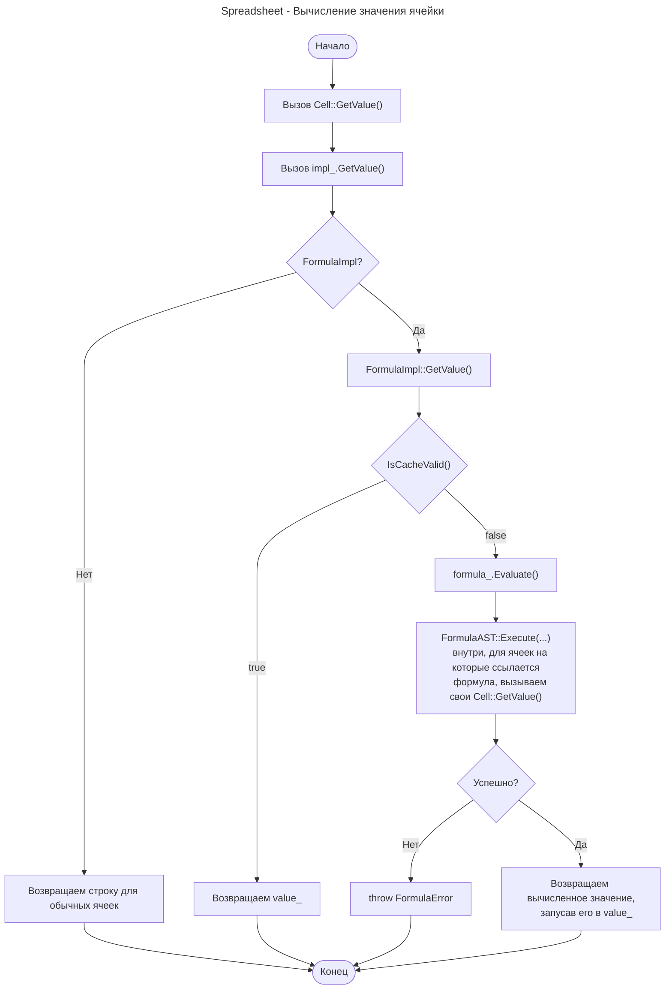

```mermaid
---
title: Spreadsheet - Вычисление значения ячейки
---
flowchart TD
    id0(["Начало"])
    id1["Вызов Cell::GetValue()"]
    id2["Вызов impl_.GetValue()"]
    id3{FormulaImpl?}
    id4["Возвращаем строку для обычных ячеек"]
    id5["FormulaImpl::GetValue()"]
    id6{"IsCacheValid()"}
    id7["Возвращаем value_"]
    id8["formula_.Evaluate()"]
    id9["FormulaAST::Execute(...)
    внутри, для ячеек на которые ссылается
    формула, вызываем свои Cell::GetValue()"]
    id10{Успешно?}
    id11["throw FormulaError"]
    id12["Возвращаем вычисленное значение,
    запусав его в value_"]
    id99(["Конец"])

    id0 --> id1
    id1 --> id2
    id2 --> id3
    id3 -->|Нет| id4
    id4 --> id99
    id3 -->|Да| id5
    id5 --> id6
    id6 -->|true| id7
    id7 --> id99
    id6 -->|false| id8
    id8 --> id9
    id9 --> id10
    id10 -->|Нет| id11
    id11 --> id99
    id10 -->|Да| id12
    id12 --> id99
```