## Создание новой ячейки

### Блок схема

#### 1. Когда происходит создание?
При вызове метода `SheetInterface::SetCell(...)`. При создании будет создан объект `Cell`, для которого будет вызван метод `Set(...)`.

#### 2. Что нужно дополнительно сделать?
1. Если это формула, выполнить разбор и убедится, что формула валидна. Выбросить исключение если нет.
2. Проверить циклические зависимости, как это описано в [cyclic_dependaencies.pdf](cyclic_dependеncies.pdf). Выбросить исключение если такие есть.
3. Если есть старая ячейка удалить её из списков завсимых, как это описывалось в [cache_invalidation.pdf](cache_invalidation.pdf).
4. Инвалидировать кэш всех зависимых ячеек.

#### 3. Где хранятся ячейки?
В `unordered_map<Position, std::unique_ptr<Cell>> cells_` в классе `Sheet`.