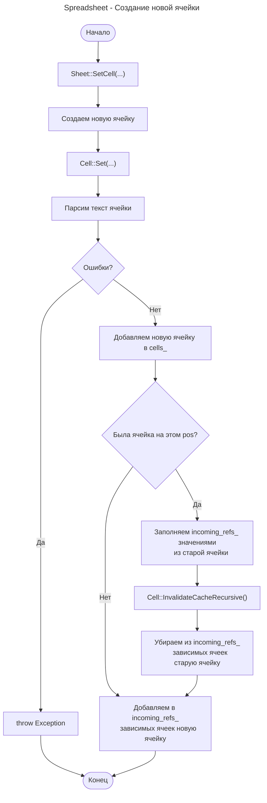

```mermaid
---
title: Spreadsheet - Создание новой ячейки
---
flowchart TD
    id0(["Начало"])
    id1["Sheet::SetCell(...)"]
    id2["Создаем новую ячейку"]
    id3["Cell::Set(...)"]
    id4["Парсим текст ячейки"]
    id5{"Ошибки?"}
    id6["throw Exception"]
    id7["Добавляем новую ячейку в cells_"]
    id8{"Была ячейка на этом pos?"}
    id9["Заполняем incoming_refs_ значениями
    из старой ячейки"]
    id10["Cell::InvalidateCacheRecursive()"]
    id11["Убираем из incoming_refs_
    зависимых ячеек старую ячейку"]
    id12["Добавляем в incoming_refs_
    зависимых ячеек новую ячейку"]
    id99(["Конец"])

    id0 --> id1
    id1 --> id2
    id2 --> id3
    id3 --> id4
    id4 --> id5
    id5 -->|Да| id6
    id6 --> id99
    id5 -->|Нет|id7
    id7 --> id8
    id8 -->|Да| id9
    id9 --> id10
    id10 --> id11
    id8 -->|Нет| id12
    id11 --> id12
    id12 --> id99

```