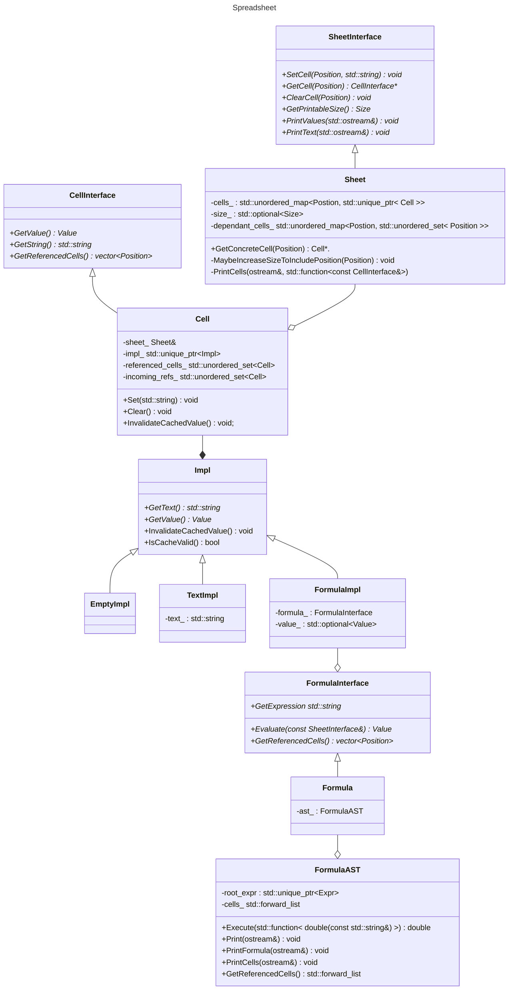

```mermaid
---
title: Spreadsheet
---
classDiagram
    CellInterface <|-- Cell
    SheetInterface <|-- Sheet
    FormulaInterface <|-- Formula
    Formula --o FormulaAST
    Sheet --o Cell
    Impl <|-- EmptyImpl
    Impl <|-- TextImpl
    Impl <|-- FormulaImpl
    Cell --* Impl
    FormulaImpl --o FormulaInterface

    class CellInterface {
        +GetValue() Value*
        +GetString() std::string*
        +GetReferencedCells() vector~Position~*
    }

    class SheetInterface {
        +SetCell(Position, std::string) void*
        +GetCell(Position) CellInterface**
        +ClearCell(Position) void*
        +GetPrintableSize() Size*
        +PrintValues(std::ostream&) void*
        +PrintText(std::ostream&) void*
    }

    class FormulaInterface {
        +Evaluate(const SheetInterface&) Value*
        +GetExpression std::string*
        +GetReferencedCells() vector~Position~*
    }

    class Cell {
        +Set(std::string) void
        +Clear() void
        +InvalidateCachedValue() void;
        -sheet_ Sheet&
        -impl_ std::unique_ptr~Impl~
        -referenced_cells_ std::unordered_set~Cell~
        -incoming_refs_ std::unordered_set~Cell~
    }

    class Sheet {
        -cells_ : std::unordered_map~Postion, std::unique_ptr< Cell >~
        -size_ : std::optional~Size~
        -dependant_cells_ std::unordered_map~Postion, std::unordered_set< Position >~
        +GetConcreteCell(Position) Cell*.
        -MaybeIncreaseSizeToIncludePosition(Position) void
        -PrintCells(ostream&, std::function~const CellInterface&~)
    }

    class Formula {
        -ast_ : FormulaAST
    }

    class FormulaAST {
        +Execute(std::function< double(const std::string&) >) double
        +Print(ostream&) void
        +PrintFormula(ostream&) void
        +PrintCells(ostream&) void
        +GetReferencedCells() std::forward_list<Position>
        -root_expr : std::unique_ptr~Expr~
        -cells_ std::forward_list<Position>
    }

    class Impl {
        +GetText() std::string*
        +GetValue() Value*
        +InvalidateCachedValue() void
        +IsCacheValid() bool
    }

    class EmptyImpl {
    }

    class TextImpl {
        -text_ : std::string
    }

    class FormulaImpl {
        -formula_ : FormulaInterface
        -value_ : std::optional~Value~
    }

```